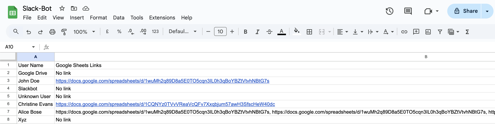

# Slack-Extractor-Bot

## 📌 **Slack Google Sheets Extractor Bot**  
**Automate. Organize. Never Lose a Spreadsheet Again.**  

### 📖 **Overview**  
The **Slack Google Sheets Extractor Bot** is a **fully automated Python tool** that scans **direct messages (DMs)** in Slack, extracts **all Google Sheets links**, and **exports them into a structured CSV file**.  

This bot is designed for professionals, teams, and organizations that frequently exchange spreadsheets via Slack and need a **centralized record** for easy access, tracking, and compliance.  

---

## 🌍 **Why This Matters? (Real-World Impact)**  
In today’s fast-paced digital workspace, critical data is often shared **across multiple Slack conversations**. Finding the right **Google Sheet link** when you need it can be a frustrating experience. **This bot solves that problem** by:  

✅ **Automating Sheet Tracking** – No need to manually search through DMs.  
✅ **Centralizing Data Access** – Keep all important spreadsheet links in one place.  
✅ **Boosting Productivity** – Save hours of effort by eliminating redundant searches.  
✅ **Enhancing Compliance & Auditing** – Maintain a **verifiable** log of shared documents.  

### 💡 **Who Can Benefit?**
📊 **Finance Teams** – Easily track all budget and financial planning spreadsheets.  
📁 **Project Managers** – Maintain a consolidated list of project tracking sheets.  
📚 **Educators & Researchers** – Collect and organize shared research materials.  
📈 **Data Analysts** – Ensure all dataset links are readily available.  
🛡️ **Compliance Teams** – Maintain logs for auditing and security purposes.  

---

## 🚀 **How to Set Up & Use**  

### **1️⃣ Prerequisites**  
Make sure you have:  
- **Python 3.x** installed on your system.  
- A **Slack User OAuth Token** with permissions:  
  - `channels:history`  
  - `users:read`  
  - `im:history`  
- Required Python packages (installation steps below).  

---

### **2️⃣ Install Dependencies**  
First, clone this repository and navigate to the project folder:  

```bash
git clone https://github.com/YOUR_USERNAME/Slack-Extractor-Bot.git
cd slack-bot-extract-links
```

Now, install the required dependencies:  

```bash
pip install -r requirements.txt
```

If you don’t have a `requirements.txt`, manually install dependencies:  

```bash
pip install slack_sdk python-dotenv
```

---

### **3️⃣ Set Up Slack API Token**  
Create a `.env` file to securely store your Slack token:  

```bash
touch .env
```

Open it and add:  

```
SLACK_USER_TOKEN=your-slack-user-oauth-token
```

🔴 **IMPORTANT:** **Never share or commit your `.env` file** – It contains sensitive credentials!  

---

### **4️⃣ Run the Bot**  
Start extracting Google Sheets links by running:  

```bash
python bot.py
```

Upon completion, the bot will generate:  

```plaintext
extracted-links.csv
```

This CSV file contains **user names** and their **Google Sheets links** from Slack DMs.  

---

## 📊 **Understanding the Output**
Your output file `extracted-links.csv` will look like this:  

| **User Name**      | **Google Sheets Links**  |  
|--------------------|------------------------|  
| Alice Johnson     | https://docs.google.com/spreadsheets/d/abcd123  |  
| Bob Smith        | https://docs.google.com/spreadsheets/d/xyz789, https://docs.google.com/spreadsheets/d/mno456  |  

Each row represents a Slack user and all Google Sheets links they have shared.  

Glimpse of an actual Output



---

## 🔄 **How Can Others Make Use of This?**
This bot can be used **as is** or extended for **custom use cases**:  

🔹 **For Personal Use** – Track important spreadsheets shared in Slack.  
🔹 **For Team Collaboration** – Automate document collection from Slack DMs.  
🔹 **For Data & Research Teams** – Categorize datasets and spreadsheets.  
🔹 **For Integration** – Connect it with **Google Sheets API** to auto-update a master sheet.  
🔹 **For Auditing & Compliance** – Maintain records of spreadsheet sharing activities.  

**Want to take it further?** Modify the script to extract links from **Slack channels** instead of just DMs!  

---

## 🛡️ **Security & Best Practices**
🔒 **DO NOT expose your `.env` file** – Always keep your API tokens private.  
📏 **Slack Rate Limits** – The script **respects Slack API limits** using batch processing.  
🛑 **Sensitive Data Handling** – The bot only extracts **publicly shareable links** from messages.  

---

## 🛠️ **Troubleshooting**
❌ **Issue: Invalid Slack Token Error**  
✅ **Solution:** Ensure your Slack OAuth token is correct and has required permissions.  

❌ **Issue: CSV File is Empty**  
✅ **Solution:** Ensure your Slack DMs contain Google Sheets links and check API permissions.  

❌ **Issue: Script Runs Too Slowly**  
✅ **Solution:** Adjust `batch_size` or modify `time.sleep()` intervals to prevent Slack API throttling.  

---

## 📜 **License**
This project is released under the **MIT License** – Free to use, modify, and distribute.  

---

## 🤝 **Contributing**
Want to improve this bot? Fork the repository, make your enhancements, and submit a pull request! 🚀  

---

## 📧 **Contact**
For issues, feature requests, or collaborations, feel free to open a **GitHub issue** or reach out via email at **shreyasdasari12@gmail.com**.  

---

🔥 **Stop searching Slack for Google Sheets links. Let this bot do it for you.**  
Start using the **Slack Google Sheets Extractor Bot** today! 🚀  
